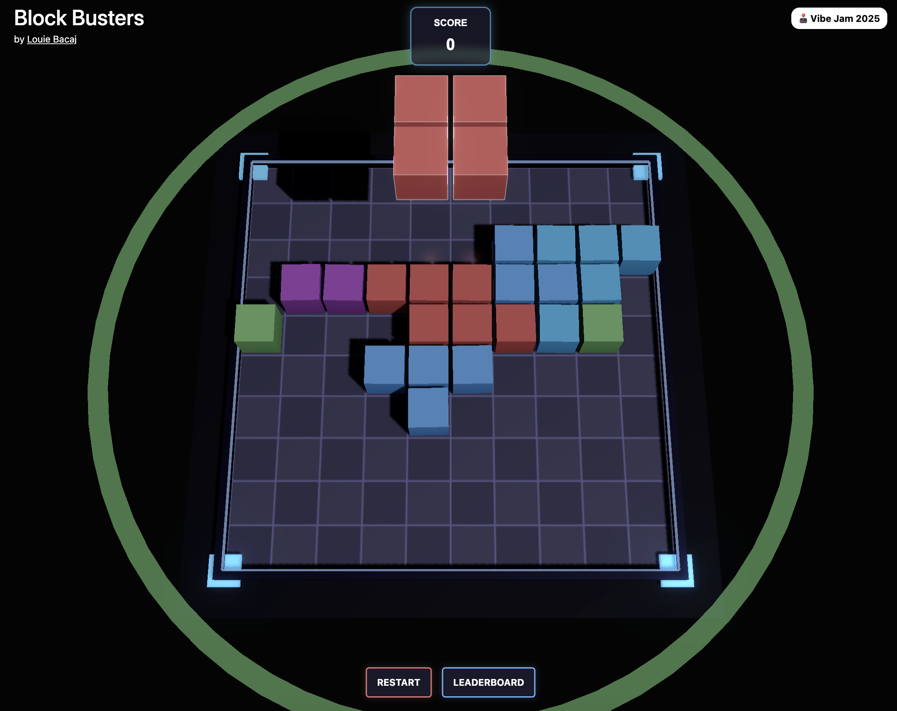

# Block Busters: A Three.js & ASP.NET Core Puzzle Game

Welcome to Block Busters! This is a "vibe coded" 3D puzzle game built with Three.js and hosted within an ASP.NET Core 9 Razor Pages application. It serves as an open-source example, and a decent template, of how to integrate a Three.js game into a .NET web environment.

This project is designed to be a straightforward template for developers looking to:
*   Combine the power of ASP.NET Core for backend logic (like leaderboards) with a fun 3D experiences using Three.js.
*   See a practical example of using ES modules and `importmap` for Three.js without complex JavaScript bundling setups for simpler projects.
*   Get a feel for a complete, albeit simple, game loop including UI, sound, and state management.

## Live Demo

Play it here: **[https://blockbusters.louiebacaj.com/](https://blockbusters.louiebacaj.com/)**



## Tech Stack

*   **Frontend (Game):**
    *   **Three.js:** A recent, module-based version (included locally in `wwwroot/js/`) for 3D rendering and game logic.
    *   **JavaScript (ES Modules):** Modern JavaScript for game development.
    *   **HTML5 & CSS3:** For game UI and layout.
*   **Backend & Hosting:**
    *   **ASP.NET Core 9 Razor Pages:** Serves the game and provides API-like endpoints for features like the leaderboard.
    *   **.NET 9:** The underlying framework.
*   **Database:**
    *   **SQLite:** For the local leaderboard functionality.
*   **Styling & UI:**
    *   **CSS3:** For game UI and basic layout styling.

## Project Structure

Here's an overview of the key directories and files:

*   `BlockPuzzleGame.csproj`: The .NET project file, defining dependencies (like Entity Framework Core for SQLite) and targeting .NET 9.
*   `Program.cs`: Configures the ASP.NET Core application, including services, routing, and static file serving.
*   `appsettings.json`: Configuration settings, including the SQLite connection string.
*   `Pages/`: Contains the Razor Pages.
    *   `Index.cshtml`: The main page that hosts the Three.js game canvas and UI elements.
    *   `Index.cshtml.cs`: The C# code-behind for `Index.cshtml`, handling leaderboard GET and POST requests.
    *   `Shared/_Layout.cshtml`: The main layout file for the Razor Pages application.
*   `wwwroot/`: Root directory for static assets served by the application.
    *   `js/blockpuzzle.js`: The core JavaScript file containing all the Three.js game logic, UI management, and interaction with the backend.
    *   `js/three.module.js`: The main Three.js library file (ES module version).
    *   `js/jsm/`: Contains additional Three.js modules used by the game (e.g., `EffectComposer`, `UnrealBloomPass`).
    *   `css/site.css`: Custom styles for the game's UI.
    *   `SoundFx/`: Contains `.wav` files for game sound effects.
    *   `images/`: Game-related images.
*   `Data/`:
    *   `ApplicationDbContext.cs`: The Entity Framework Core DbContext for interacting with the leaderboard database.
    *   `leaderboard.db` (created at runtime): The SQLite database file.
*   `Models/`:
    *   `LeaderboardEntry.cs`: EF Core entity for a leaderboard entry.
    *   `LeaderboardDTO.cs`: Data Transfer Object for sending leaderboard data to the client.
*   `README.md`: This file!

## How It Works

### ASP.NET Core Backend

The ASP.NET Core application, built with Razor Pages, is responsible for:

1.  **Serving the Game:** `Pages/Index.cshtml` is the entry point that renders the HTML structure needed for the game.
2.  **Static File Hosting:** `Program.cs` is configured with `app.MapStaticAssets()` and `app.MapRazorPages().WithStaticAssets()` to serve static files (JavaScript, CSS, images, sounds) from the `wwwroot` directory.
3.  **Leaderboard API:**
    *   The `Pages/Index.cshtml.cs` file defines Razor Page Handlers:
        *   `OnGetLeaderboardAsync()`: Fetches the top leaderboard scores.
        *   `OnPostSaveScoreAsync([FromBody] LeaderboardDTO scoreData)`: Saves a new score to the leaderboard.
    *   These handlers are called by the `blockpuzzle.js` frontend using `fetch` requests.
4.  **Database Interaction:** Uses Entity Framework Core with a SQLite provider to manage the `leaderboard.db`. The database is automatically created on first run if it doesn't exist due to `dbContext.Database.EnsureCreated();` in `Program.cs`.

### Three.js Integration

The integration of Three.js into the Razor Page is a key aspect:

1.  **Canvas Container:** `Pages/Index.cshtml` defines a `div` with `id="gameContainer"` where the Three.js renderer will place its canvas.
2.  **Importmap for Three.js:** A modern and clean way to manage JavaScript module imports without a bundler. `Pages/Index.cshtml` includes:
    ```html
    <script type="importmap">
    {
        "imports": {
            "three": "/js/three.module.js"
        }
    }
    </script>
    ```
    This tells the browser that whenever it sees `import ... from 'three'`, it should load `/js/three.module.js`.
3.  **Loading Game Logic:** The main game script is loaded as an ES module:
    ```html
    <script type="module" src="~/js/blockpuzzle.js" asp-append-version="true"></script>
    ```
    The `asp-append-version="true"` tag helper is useful for cache-busting.

### Game Logic (`wwwroot/js/blockpuzzle.js`)

This single, comprehensive JavaScript file orchestrates the entire game:

*   **Three.js Setup:** Initializes the `THREE.Scene`, `THREE.PerspectiveCamera`, and `THREE.WebGLRenderer`. It also sets up post-processing effects like `UnrealBloomPass` using `EffectComposer`.
*   **Game Elements:** Defines piece shapes (`PIECES`), colors (`COLORS`), and manages the game grid (`grid`).
*   **Rendering Loop:** An animation loop (`AnimationManager.animate`) updates game logic and renders the scene.
*   **User Interaction:**
    *   Handles mouse and touch events for dragging and dropping pieces.
    *   Calculates piece positions on the 2D grid from 3D world coordinates.
*   **Gameplay Mechanics:**
    *   Piece generation and preview.
    *   Placement validation (`canPlacePiece`).
    *   Line clearing (rows, columns, and 3x3 regions) with animations.
    *   Scoring.
    *   Game over detection and display.
*   **Audio Management:** An `AudioManager` class loads and plays sound effects for various game events.
*   **Dynamic UI:**
    *   Creates and updates HTML elements for the score display, game buttons (Restart, Leaderboard), leaderboard panel, and game over screen. These elements are overlaid on the Three.js canvas.
*   **Backend Communication:** Uses `fetch` to get leaderboard data and save scores via the ASP.NET Core backend.
*   **Responsive Adjustments:** Includes logic (`optimizeForDevice`) to adjust game parameters (like `CELL_SIZE`) and UI for mobile devices.

## Getting Started

Follow these steps to get the game running locally:

### Prerequisites

*   **.NET 9 SDK:** Download and install from [the official .NET website](https://dotnet.microsoft.com/download/dotnet/9.0).

### Cloning and Running

1.  **Clone the repository:**
    ```bash
    git clone https://your-repository-url/BlockPuzzleGame.git
    cd BlockPuzzleGame
    ```
    *(Replace `https://your-repository-url/BlockPuzzleGame.git` with the actual URL of your repository after you publish it.)*

2.  **Clean the project (optional but good practice):**
    ```bash
    dotnet clean
    ```

3.  **Run the application:**
    ```bash
    dotnet run
    ```

4.  **Open in browser:**
    The console will output the URLs the application is listening on (e.g., `http://localhost:5000` and `https://localhost:5001`). Open one of these in your web browser.

### Database

*   The SQLite database for the leaderboard (`Data/leaderboard.db`) will be automatically created in the `Data/` directory when you first run the application.

## Why This Template?

This project can serve as a template because:

*   **Integration:** It demonstrates a clean and up-to-date method for integrating Three.js with the latest version of ASP.NET Core Razor Pages.
*   **Simplified JavaScript Workflow:** Utilizes ES modules and `importmap`, avoiding the need for complex JavaScript bundling tools (like Webpack or Parcel) for simpler projects. This makes it easier to get started and understand the Three.js integration. LLMs like to use older versions of Three.js and this isn't ideal for making games.
*   **Full-Stack Example:** Provides a complete, albeit simple, full-stack example, from frontend 3D rendering and game logic to backend API endpoints and database interaction.
*   **Focus on Recent Three.js:** Employs a recent, locally-hosted version of Three.js, showcasing current best practices rather than relying on older API patterns often spit out by LLMs.
*   **"Vibe Coded" Spirit:** It's a good starting point for quickly prototyping and developing web-based 3D games and experiences.
*   **Clear Separation:** While the game logic is primarily client-side, it clearly shows how to connect to a .NET backend for persistent data or more complex server-side operations.

## Deployment

This project is currently configured for deployment and has been deployed to Azure App Service, as an Azure Website.

But you can deploy it anywhere you like that can run .NET

For users deploying to other platforms or using different methods, these .deployment, azure-deploy.json, buildCmd files might not be necessary or may need adaptation.

## License

This project is licensed under the MIT License - see the [LICENSE.md](LICENSE.md) file for details.
